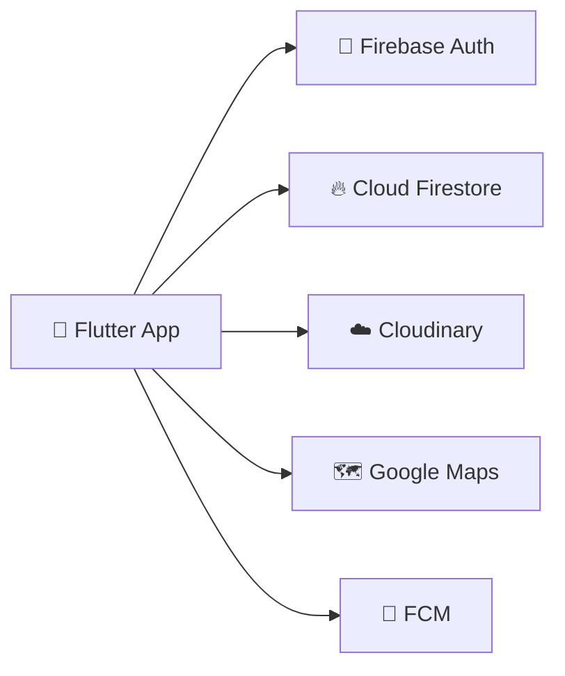

<div align="center">


# NearWork

### find work. nearby. no cap.

**the job app for Sri Lanka that actually gets it — map first, no boring CV forms, just jobs near you** 🗺️💚

<br/>


<br/>

**[ ✨ Features ](#-whats-inside) · [ 🛠 Stack ](#-the-stack) · [ 🚀 Run it ](#-get-it-running) · [ 🗺 Roadmap ](#-whats-next)**

</div>

<br/>

## 🫠 the problem

every job app in Sri Lanka is stuck in 2012. full-time only, CV uploads, zero location awareness, and half of "part-time jobs" hiring still happens in random Facebook groups. wild.

if you just want a shift at a café 2km away, good luck finding that on a normal job board.

## ✨ the fix

**NearWork drops jobs on a map.** you see what's near you, you filter by distance/salary/vibe, you apply in one tap with a saved resume, you chat with the employer directly. that's it. that's the app.

<br/>

## 📦 what's inside

<table>
<tr>
<td width="50%" valign="top">

### for job seekers 👀
- 🔐 one-tap Google Sign-In, zero forms
- 🗺️ live map with jobs shown as **actual job photos** as markers
- 🎚️ filter by distance, salary, category, job type, experience
- 🔎 smart search w/ autocomplete
- 📄 resume library — upload once, use everywhere
- ⚡ apply in literally one tap
- 💬 real-time chat, no phone tag
- 🔖 save jobs, share to your group chat

</td>
<td width="50%" valign="top">

### for employers 💼
- 📝 post a job in under 2 minutes
- 📍 drop a pin on the exact location
- 📊 see live view counts on your post
- 📥 inbox with resume preview built in
- ✅ move applicants through a status pipeline
- 📞 call / WhatsApp / directions, one tap away

</td>
</tr>
</table>

### 🔮 cooking rn
- 🤖 AI job matching — keyword-matches your profile to new postings and pings you
- ✅ posting verification (bye bye scam listings)
- 🇱🇰 Sinhala & Tamil support

<br/>

## 🛠 the stack

no boring table. just vibes.

`Flutter` `Dart` `Provider` `Firebase Auth` `Cloud Firestore` `Cloudinary` `Google Maps Platform` `Geolocator` `Firebase Cloud Messaging` `GitHub Actions`

**basically:** Flutter does the pretty stuff, Firebase does the heavy lifting, Google Maps does the maps, Cloudinary holds the images. zero custom backend, maximum speed.

<br/>

## 🏗 how it's built

feature-first architecture. every feature minds its own business — models, providers, services, screens, all self-contained. no spaghetti.

```
lib/
├── core/            → shared stuff (colors, utils, app-wide services)
└── features/
    ├── auth/         → Google Sign-In
    ├── explore/      → the map, the filters, the whole vibe
    ├── post_job/     → job creation + location picker
    ├── messages/     → real-time chat + application pipeline
    └── profile/      → resumes, saved jobs, settings
```



**the rules:** UI never touches Firestore directly. providers hold state, services do persistence, widgets just render. security rules do all the access control — no custom backend to hack.

<br/>

## 🚀 get it running

```bash
git clone https://github.com/chamishkadilina/near-work-android.git
cd near-work-android
flutter pub get
```

**you'll need:**

| what | where it goes |
|---|---|
| `google-services.json` | `android/app/` |
| `GoogleService-Info.plist` | `ios/Runner/` |
| Maps API key | `AndroidManifest.xml` + `AppDelegate.swift` |
| SHA-1 fingerprint | Firebase console (Auth → Google Sign-In won't work without it) |
| Cloudinary creds | `cloudinary_service.dart` |

grab your SHA-1:
```bash
cd android && ./gradlew signingReport
```

deploy the security rules:
```bash
firebase deploy --only firestore:rules
```

then just:
```bash
flutter run
```

**shipping a build?**
```bash
flutter build apk --release        # Android
flutter build appbundle --release  # Play Store
flutter build ios --release        # iOS
```

> ⚠️ never commit `google-services.json`, API keys, or Cloudinary secrets. `.gitignore` them, keep them in your CI secrets or wherever your team stashes that stuff.

<br/>

## 🧪 tests

```bash
flutter test       # run the tests
flutter analyze    # keep the code honest
```

<br/>

## 📸 the app

<div align="center">

| Login | Explore | Job Details | Chat |
|:---:|:---:|:---:|:---:|
| _screenshot goes here_ | _screenshot goes here_ | _screenshot goes here_ | _screenshot goes here_ |

</div>

<br/>

## 🗺 what's next

- [x] Google Sign-In
- [x] map + filters that actually work
- [x] job posting w/ location pin
- [x] real-time chat + status pipeline
- [x] resumes + saved jobs
- [x] job photos as map markers 🔥
- [ ] AI job matching + push notifs
- [ ] posting verification
- [ ] Sinhala & Tamil
- [ ] ratings after a job's done
- [ ] iOS App Store drop

<br/>

## 🤝 contributing

solo-built rn but PRs and issues are welcome. open an issue before a big PR so we're on the same page.

```bash
git checkout -b feature/your-idea
git commit -m "add: your idea"
git push origin feature/your-idea
```

then open a PR and let's talk.

<br/>

## 📄 license

MIT. do what you want, just don't sue me. see [`LICENSE`](LICENSE).

<br/>

<div align="center">

### built by J.A.C.D. Kumara (Chamishka) — FusionBytes Studio

[](https://github.com/chamishkadilina)

**made with 💚 in Sri Lanka, powered by way too much coffee ☕**

</div>
